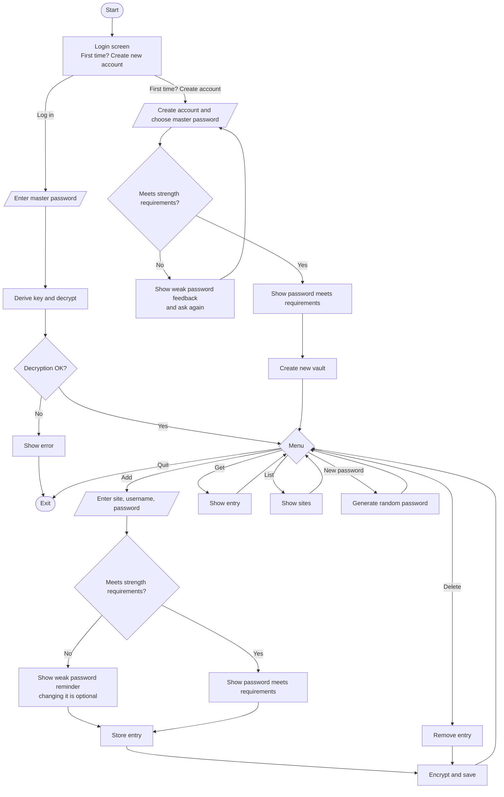

# Program flowchart

```mermaid
flowchart TD
    A([Start]) --> B[Login screen<br/>First time? Create new account]
    B -- Log in --> C[/Enter master password/] --> D[Derive key and decrypt]
    B -- First time? Create account --> E[/Create account and choose master password/]
    E --> P{Meets strength requirements?}
    P -- No --> Q[Show weak password feedback<br/>and ask again] --> E
    P -- Yes --> R[Show password meets requirements] --> F[Create new vault]
    D --> G{Decryption OK?}
    G -- No --> I[Show error] --> Z([Exit])
    G -- Yes --> H{Menu}
    F --> H
    H -- Add --> J[/Enter site, username, password/]
    J --> S{Meets strength requirements?}
    S -- No --> T[Show weak password reminder<br/>changing it is optional]
    S -- Yes --> U[Show password meets requirements]
    T --> V[Store entry] --> K[Encrypt and save]
    U --> V
    H -- Get --> L[Show entry] --> H
    H -- Delete --> M[Remove entry] --> K
    H -- List --> N[Show sites] --> H
    H -- New password --> O[Generate random password] --> H
    K --> H
    H -- Quit --> Z
```
