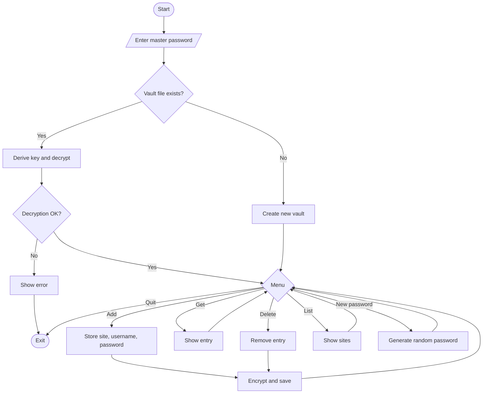

# Program flowchart

```mermaid
flowchart TD
    A([Start]) --> B[/Enter master password/]
    B --> C{Vault file exists?}
    C -- No --> D[Create new vault]
    C -- Yes --> E[Derive key and decrypt]
    E --> F{Decryption OK?}
    F -- No --> G[Show error] --> Z([Exit])
    F -- Yes --> H
    D --> H{Menu}
    H -- Add --> I[Store site, username, password] --> J[Encrypt and save] --> H
    H -- Get --> K[Show entry] --> H
    H -- Delete --> L[Remove entry] --> J
    H -- List --> M[Show sites] --> H
    H -- New password --> N[Generate random password] --> H
    H -- Quit --> Z
```
