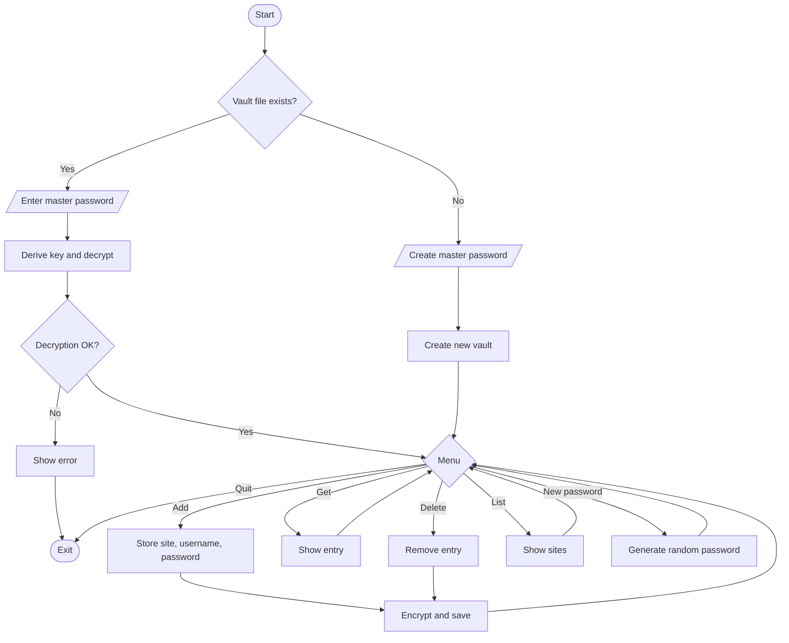

# Program flowchart

```mermaid
flowchart TD
    A([Start]) --> B{Vault file exists?}
    B -- No --> C[/Create master password/] --> D[Create new vault]
    B -- Yes --> E[/Enter master password/] --> F[Derive key and decrypt]
    F --> G{Decryption OK?}
    G -- No --> I[Show error] --> Z([Exit])
    G -- Yes --> H{Menu}
    D --> H
    H -- Add --> J[Store site, username, password] --> K[Encrypt and save]
    H -- Get --> L[Show entry] --> H
    H -- Delete --> M[Remove entry] --> K
    H -- List --> N[Show sites] --> H
    H -- New password --> O[Generate random password] --> H
    K --> H
    H -- Quit --> Z
```
